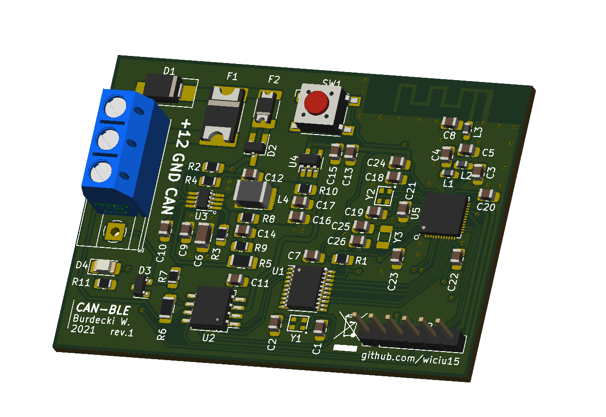

#### *TLDR: Controlling spotify on the phone, with car's CAN bus*

This project is a ***work in progress***. Comes with no warranty. Vehicles CAN-bus is a powerful tool, ***use at your own risk***, author does not have responsibility for any damage on property or health.

Intended for ***2011-2013 Chevrolet Volt***, may work with other General Motors Global Platform A cars.
Uses own ***MCP2515 CAN controller*** chip library to interact with CAN-bus (Low-speed SWCAN/GMLAN in General Motors Vehicles).

Nordic ***NRF51822 microcontroler*** is in charge of Bluetooth LE connection and HID protocol.
HID report descriptor is custom and supports only 7 consumer control(multimedia) keys, like Play/Pause, Scan Next, Scan Prev, Mute.

CAN frames processing is offloaded to MCP2515 with usage of filters, to reduce uC usage and energy efficiency.
While MCP2515 is used in normal operating mode, device should not transmit anything other than error/ack frames.

PCB design needs some fixes and further testing. As of this moment 16Mhz crystal footprint is mirrored, MCP2515 INT pin needs a pullup resistor and SWDIO/RST pullup+optional power-on-reset 2.2u capacitor.

**[Project log on hackaday.io](https://hackaday.io/project/176834-chevy-volt-sw-can-ble-multimedia-control)**

Provided files are Eclipse GNU MCU Embedded project. To build it you need to also provide NRF SDK v12.3 (include directories), GCC arm-none-eabi compiler, and OpenOCD to use flash script (flash.bat file) with ST-Link v2 SWD programmer.

Software contains code from linux kernel CAN driver, and open-usb-can project by Fabio Baltieri.

**Software licensed under GNU General Public License v3.**
This program is free software: you can redistribute it and/or modify
it under the terms of the GNU General Public License as published by
the Free Software Foundation, either version 3 of the License, or
(at your option) any later version.
